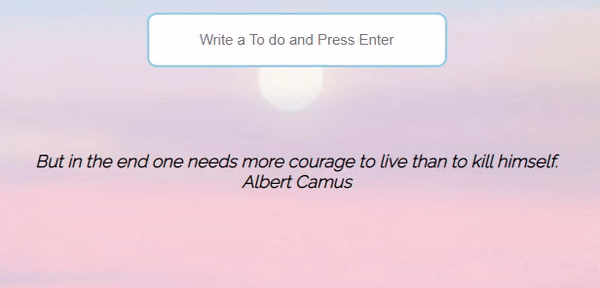

# To do list Chrome app

[Start](https://hwahyeon.github.io/browserjs/)

## Feature Overview

### Name
The app remembers the user's name entered through the browser. If the app gets to know your name, it will welcome you with greetings from around the world.

### Clock
It provides a clock in the format of 00:00:00.

### To-Do list
The app provides a 'To-Do list'. You can register up to 7 tasks. Through the browser (local storage), the app stores the tasks. Unless you reset the browser, the app will remember the tasks.

### Quotes
The app offers a random quote from a book and its author.

### Location and weather
When the app is launched, it asks for permission to 'check my location'. If allowed, it provides the current weather, temperature, and location at the bottom.

### Background
When you start anew or refresh, the background changes randomly.
